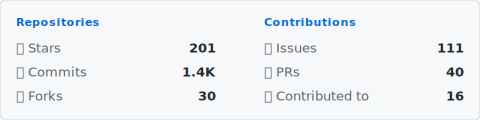

# Github profile stats svg generator

Yet another GitHub stats card generator.  
Modern UI Github Action for your profiles.

<picture>
  <source media="(prefers-color-scheme: dark)" srcset="./output/dark.svg">
  
</picture>

## What it does

Generates an SVG with your GitHub stats:

- ⭐ Stars (total across all your repos)
- 📝 Commits (all time, not just last year)
- 🍴 Forks
- 🐛 Issues
- 🔀 PRs
- 📦 Repos you've contributed to

Updates daily via GitHub Actions.  
Commits the new SVG automatically.

## Setup

### 1. Fork this repo

### 2. Create a GitHub token

Go to [Settings → Developer settings → Personal access tokens → Fine-grained tokens](https://github.com/settings/personal-access-tokens)

No extra access needed, default scope works good.

### 3. Add the token as a secret

Repo → Settings → Secrets and variables → Actions → New repository secret

Name: `GH_TOKEN`  
Value: `your token`

### 4. Run the workflow

Actions → Generate GitHub Profile Stats SVG → Run workflow

Or just wait until midnight UTC, it runs daily.

### 5. Add to your profile README

Force dark theme:

```markdown

```

Auto theme:

```markdown
<picture>
  <source media="(prefers-color-scheme: dark)" srcset="https://github.com/YOUR_USERNAME/git-pf-stats-svg/raw/master/output/dark.svg">
  
</picture>
```

## Local dev

```bash
# install deps
npm i

# start dev server
npm run dev

# with mock data
npm run dev:mock

# build svg
npm run build

# build frontend
npm run build:client
```

To run dev server with actual data setup `.env`

## Stack

- Node.js
- D3 + jsdom for SVG generation
- GitHub GraphQL API
- Chokidar for file watching in dev mode
- Svelte + vite for dev server frontend
